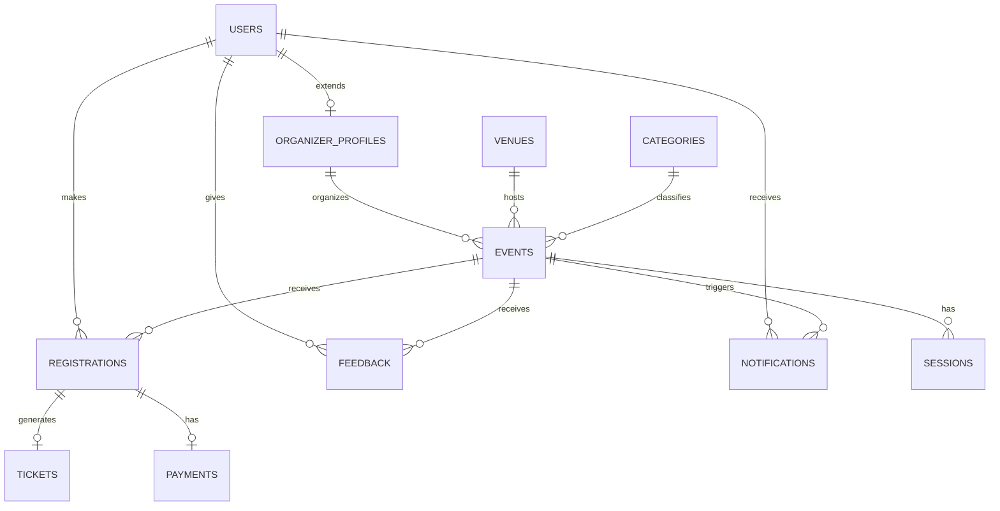

# Event Pulse System — DBMS Minor Project

A relational database system for managing college/organizational events: event creation, registrations, ticketing, payments, and feedback.

## 1. Objective
Design and implement a normalized relational database for an event management platform, and demonstrate it with a working backend API.

## 2. Tech Stack
- **Database:** MySQL 8.x
- **Backend:** Node.js + Express + mysql2 (demo API layer)
- **Tools:** VS Code, MySQL Workbench (optional, for ER visualization)

## 3. Entities (11 tables)
| Entity | Purpose |
|---|---|
| Users | All system users (attendee/organizer/admin) |
| Organizer_Profiles | Extra info for organizer-role users (1:1) |
| Venues | Physical locations events are held at |
| Categories | Event types (Technical, Cultural, etc.) |
| Events | Core event records |
| Sessions | Sub-sessions/talks within an event |
| Registrations | Resolves M:N between Users and Events |
| Tickets | Generated per confirmed registration |
| Payments | Payment record per registration |
| Feedback | Post-event rating/comments (M:N resolver) |
| Notifications | Messages sent to users |

## 4. ER Diagram



## 5. Normalization
- **1NF:** Every column holds atomic values (e.g., no comma-separated speaker lists — `Sessions` is a separate table).
- **2NF:** No table has a composite primary key with partial dependency; all non-key attributes depend on the whole key.
- **3NF:** No transitive dependencies — e.g., `organization_name` lives in `Organizer_Profiles`, not repeated on every `Events` row; `venue capacity` isn't duplicated on `Events`.
- Many-to-many relationships (Users↔Events for registration, Users↔Events for feedback) are resolved with junction tables (`Registrations`, `Feedback`).

## 6. Key DBMS Concepts Demonstrated
- Primary/Foreign keys, `UNIQUE`, `CHECK` constraints
- `ENUM` for controlled vocabularies
- Views: `vw_event_summary`, `vw_my_registrations`
- Stored procedure: `sp_register_for_event` (capacity-aware registration)
- Triggers: auto-ticket generation, prevent registering for ended events
- Aggregate queries: `JOIN`, `GROUP BY`, `HAVING`, subqueries

## 7. Setup (VS Code)

1. **Install MySQL** locally (or use XAMPP/WAMP) and open a terminal in VS Code.
2. Run the SQL scripts in order:
   ```bash
   mysql -u root -p < database/01_schema.sql
   mysql -u root -p < database/02_sample_data.sql
   mysql -u root -p < database/03_views_procedures_triggers.sql
   ```
3. Test queries: open `database/04_sample_queries.sql` in VS Code (with the **SQLTools** or **MySQL** extension) and run them against `event_pulse_system`.
4. **Backend API:**
   ```bash
   cd backend
   npm install
   ```
   Create a `.env` file in `backend/`:
   ```
   DB_HOST=localhost
   DB_USER=root
   DB_PASSWORD=yourpassword
   DB_NAME=event_pulse_system
   PORT=5000
   ```
   Then run:
   ```bash
   npm start
   ```
5. Test endpoints (e.g., in Postman or browser):
   - `GET  http://localhost:5000/api/events`
   - `GET  http://localhost:5000/api/events/1`
   - `POST http://localhost:5000/api/registrations` with body `{ "event_id": 1, "user_id": 6 }`
   - `GET  http://localhost:5000/api/registrations/user/4`

## 8. Project Structure
```
event-pulse-system/
├── database/
│   ├── 01_schema.sql
│   ├── 02_sample_data.sql
│   ├── 03_views_procedures_triggers.sql
│   └── 04_sample_queries.sql
├── backend/
│   ├── package.json
│   ├── db.js
│   ├── server.js
│   └── routes/
│       ├── events.js
│       └── registrations.js
└── README.md
```

## 9. Possible Extensions (for viva/bonus marks)
- Role-based auth (JWT) on the API
- QR-code check-in using the `ticket_code`
- A React frontend calling these endpoints
- Waitlist auto-promotion trigger when a CONFIRMED registration is cancelled
